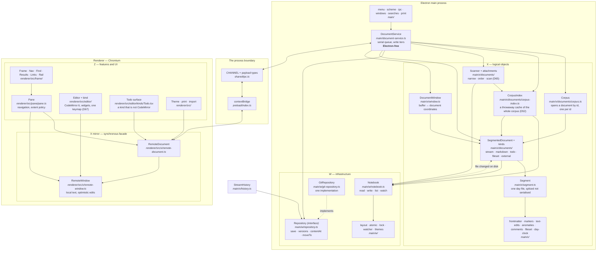

# Architecture, as built

**A map, not a design.** `architecture.md` holds the layering principles and the
rules that keep them honest; this says where each of those things actually lives
and what the contract between them is, so that "where does X happen" has a
one-line answer.

**Current as of v1 complete (2026-09-10).** Everything below exists and runs;
the ordered plan in `milestones.md` is finished and what remains there is
wanted-on-demand.

---

## The shape

**X lives in main, not in a hidden renderer** (D37). One consequence shapes
everything else: the renderer holds a *mirror* of X — `RemoteDocument` and
`RemoteWindow` — which keeps a local copy of the text so that coordinates can be
answered **synchronously**. An editor cannot await an IPC round trip to find out
where a character is.

---

## The contracts, and where each one is written down

| Boundary | Contract | File |
|---|---|---|
| Z ↔ X | Document, window, positions, edits | `shared/document-api.ts` |
| Z ↔ X | Navigation targets, boundary states | `shared/pane-api.ts` |
| Z ↔ X | History, generations | `shared/history-api.ts` |
| Z ↔ X | The sidebar's questions | `shared/nav-api.ts` |
| Z ↔ X | A query, and what comes back | `shared/search-api.ts` (D65) |
| across processes | Channel names and payload shapes | `shared/ipc.ts` |
| across processes | The exposed surface itself | `preload/index.ts` (+ `.d.ts`) |
| X ↔ W | Files, listing, watching | `Notebook` in `main/w/notebook.ts` |
| X ↔ W | Where a file goes | `main/w/layout.ts` |
| X ↔ W | Durable versioned storage | `Repository` in `main/w/repository.ts` |
| anywhere | Themes | `shared/theme.ts` |
| anywhere | Format anomalies | `shared/anomalies.ts` |
| anywhere | Extent policy, screens→chars | `shared/extent.ts` |
| anywhere | Positions, dates | `shared/positions.ts`, `shared/dates.ts` |
| anywhere | The task-item grammar | `shared/kinds/todo.ts` (D55, D56) |
| anywhere | The query notation | `shared/query-text.ts` |
| anywhere | What a link is, and its key | `shared/links.ts`, `shared/link-index.ts` (D61) |
| anywhere | A tag's spelling and identity | `shared/tags.ts` (T16) |
| anywhere | The app's URL scheme, and image srcs | `shared/scheme.ts` (R7) |
| anywhere | A phrase, matched | `shared/phrase.ts` |
| anywhere | A line as a reader reads it | `shared/plain.ts` |

**`shared/` is type-only plus pure functions.** No Node, no Electron, no
CodeMirror — which is what lets the same rules be tested under `node --test` and
run in the browser. `frame/metrics.ts` is the one renderer file compiled into
both projects, for that reason.

---

## Where things happen

| Looking for | It is here |
|---|---|
| Typing reaches the file | `bind.ts` → `RemoteWindow.edit` → IPC → `DocumentService.edit` → `DocumentWindow.edit` → the document's `replace` → `Segment` → `Notebook.write` |
| An edit crossing midnight is split | `DocumentWindow.#toDocumentEdits` — property-tested over every range |
| Which day owns a boundary offset | `DocumentWindow.#segmentAt`; the later day owns it |
| Undo and redo | `SegmentedDocument.#stepBack` / `redo`; both directions derived there |
| Work is saved to history | `DocumentService` commit tier → `Repository.save` |
| Reading an old version | `StreamHistory.readDay` → `Repository.contentAt` |
| Undo that lands off-screen | `App.tsx`, the `revealing` wrapper — navigates to it |
| External edits are adopted | `Notebook` watcher → the document; divergence is surfaced, never resolved (D12) |
| Text is written to disk | `DocumentService` write tiers — quiescence **and** a ceiling |
| The window never moves | `frame/metrics.ts` + `Frame.tsx` (D42) |
| Type is decided | `shared/theme.ts` + `theme/useTheme.ts`; files in `config/themes/` |
| Markup is hidden or revealed | `editor/kinds/markdown/widgets.ts` — and see **Q11**, unresolved |
| Format problems surface | `main/x/anomalies.ts` → titlebar count → `frame/Anomalies.tsx` |
| **Which day it is** | `main/x/day-clock.ts` — `writingDay` waits for you to stop, `clockDay` is the calendar (D62); the zone is chosen, not detected (D63) |
| **A document is opened by id** | `Corpus.use` in `main/x/documents/corpus.ts`; the kind comes from the name (D59, `kindOf`) |
| **What the sidebar knows about the whole corpus** | `CorpusIndex` — subjects, bookmarks, timeline, links, threads, task items. A cache of a scan, keyed by file and stamped; deleting `.tephra/index` costs only time (D52) |
| **A task item's grammar** | `shared/kinds/todo.ts` — one line carries text, status, tags, due date, notes and identity (D55, D56) |
| **The walk, and what a day carried** | `main/x/documents/kinds/todo.ts` — `carry`, `walkOf`, `finishWalk` (T11) |
| **Every link in the corpus** | `CorpusIndex.links()` → `frame/Links.tsx` (R10a, D60) |
| **A search** | `shared/query-text.ts` parses; `Scanner` in `main/x/documents/search.ts` narrows, orders and scans; `main/searches.ts` holds the cursors; `frame/Find.tsx` walks and `frame/Results.tsx` lists (D65, D66) |
| **An image arrives** | the editor's paste/drop handler → `DocumentService.attachImage` → `x/documents/attachments.ts`; the link is inserted by the ordinary edit path (R7) |
| **An image is displayed** | `shared/scheme.ts`'s `imageSrc` → `tephra://notebook/…`, served by `main/scheme.ts` |
| **Printing** | `renderer/src/print/` builds the page, `main/print.ts` renders it; the base for relative links is a `Base` (day or document) |
| **Comments in the margin** | `main/x/comments.ts` → `frame/Rail.tsx`, anchored by markers |
| **What each window is showing, and restoring it** | `main/windows.ts` + `shared/ui-state.ts`; per-window location and cursor, machine-local theme, list view and search width (D30) |
| **Which keys do what** | `solution/keymap.md`, kept true by `tests/unit/keymap.test.ts` |

---

## Two rules the code depends on

**Positions are (segment, offset, generation), never buffer offsets** — D11. A
buffer offset means nothing across a reload, because the next window may load a
different range and the same number would name different text. The one
deliberate exception is soft state like the stored cursor, "precisely because
being wrong is cheap and self-correcting."

**Edits are optimistic and never awaited on the typing path** — R1.1. The editor
paints, `RemoteWindow` applies the edit to its local copy immediately, and the
IPC round trip confirms afterwards. Main is authoritative: if the acked length
disagrees, the window resynchronises and raises `DesyncError` rather than
continuing on a buffer that no longer describes the document.

---

## What is not here

**The ordered plan is finished** (`milestones.md`), so this section is short and
is about scope rather than sequence.

- **Sync and mobile are v2.** v2a is sync alone, v2b is Android; the order
  matters because the phone needs a corpus before any judgement about it means
  anything (`components.md`).
- **A text index is v2** (D23). v1 searches by scanning, and D65's split —
  narrowing predicates answered from the index, filtering predicates that must
  read text — is what makes the index a later addition rather than a later
  rewrite. Ranked ordering arrives with it, because a scan cannot rank-stream.
- **The composite document** — passages from many files read as one — is
  descoped, not deferred (D9 as amended). Search results are a panel and the
  link directory is a location, and both are read-only, so v1 never had to
  decide whether a filtered view is editable.
- **Rendered *editing* of inline constructs**, the keymap's design, and the
  visual system's next pass are all in the backlog: wanted-on-demand, not
  scheduled.
- **Vim is gone** (D67), not switched off. There is one keymap.
