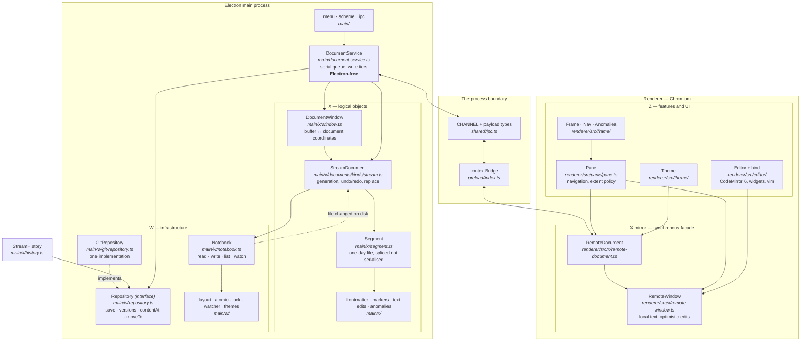

# Architecture, as built

**A map, not a design.** `architecture.md` holds the layering principles and the
rules that keep them honest; this says where each of those things actually lives
and what the contract between them is, so that "where does X happen" has a
one-line answer.

Current as of MV. Everything below exists and runs.

---

## The shape

**X lives in main, not in a hidden renderer** (D37). One consequence shapes
everything else: the renderer holds a *mirror* of X — `RemoteDocument` and
`RemoteWindow` — which keeps a local copy of the text so that coordinates can be
answered **synchronously**. An editor cannot await an IPC round trip to find out
where a character is.

---

## The contracts, and where each one is written down

| Boundary | Contract | File |
|---|---|---|
| Z ↔ X | Document, window, positions, edits | `shared/document-api.ts` |
| Z ↔ X | Navigation targets, boundary states | `shared/pane-api.ts` |
| Z ↔ X | History, generations | `shared/history-api.ts` |
| across processes | Channel names and payload shapes | `shared/ipc.ts` |
| across processes | The exposed surface itself | `preload/index.ts` (+ `.d.ts`) |
| X ↔ W | Files, listing, watching | `Notebook` in `main/w/notebook.ts` |
| X ↔ W | Where a file goes | `main/w/layout.ts` |
| X ↔ W | Durable versioned storage | `Repository` in `main/w/repository.ts` |
| anywhere | Themes | `shared/theme.ts` |
| anywhere | Format anomalies | `shared/anomalies.ts` |
| anywhere | Extent policy, screens→chars | `shared/extent.ts` |
| anywhere | Positions, dates | `shared/positions.ts`, `shared/dates.ts` |

**`shared/` is type-only plus pure functions.** No Node, no Electron, no
CodeMirror — which is what lets the same rules be tested under `node --test` and
run in the browser. `frame/metrics.ts` is the one renderer file compiled into
both projects, for that reason.

---

## Where things happen

| Looking for | It is here |
|---|---|
| Typing reaches the file | `bind.ts` → `RemoteWindow.edit` → IPC → `DocumentService.edit` → `DocumentWindow.edit` → `StreamDocument.replace` → `Segment` → `Notebook.write` |
| An edit crossing midnight is split | `DocumentWindow.#toDocumentEdits` — property-tested over every range |
| Which day owns a boundary offset | `DocumentWindow.#segmentAt`; the later day owns it |
| Undo and redo | `StreamDocument.#stepBack` / `redo`; both directions derived there |
| Work is saved to history | `DocumentService` commit tier → `Repository.save` |
| Reading an old version | `StreamHistory.readDay` → `Repository.contentAt` |
| Undo that lands off-screen | `App.tsx`, the `revealing` wrapper — navigates to it |
| External edits are adopted | `Notebook` watcher → `StreamDocument`; divergence is surfaced, never resolved (D12) |
| Text is written to disk | `DocumentService` write tiers — quiescence **and** a ceiling |
| The window never moves | `frame/metrics.ts` + `Frame.tsx` (D42) |
| Type is decided | `shared/theme.ts` + `theme/useTheme.ts`; files in `config/themes/` |
| Markup is hidden or revealed | `editor/widgets.ts` — and see **Q11**, unresolved |
| Format problems surface | `main/x/anomalies.ts` → titlebar count → `frame/Anomalies.tsx` |

---

## Two rules the code depends on

**Positions are (segment, offset, generation), never buffer offsets** — D11. A
buffer offset means nothing across a reload, because the next window may load a
different range and the same number would name different text. The one
deliberate exception is soft state like the stored cursor, "precisely because
being wrong is cheap and self-correcting."

**Edits are optimistic and never awaited on the typing path** — R1.1. The editor
paints, `RemoteWindow` applies the edit to its local copy immediately, and the
IPC round trip confirms afterwards. Main is authoritative: if the acked length
disagrees, the window resynchronises and raises `DesyncError` rather than
continuing on a buffer that no longer describes the document.

---

## Not built yet

Day-file split, the WAL, git, and the purge procedure are **M1** — the corpus is
not yet safe. Range operations (tag, bookmark, print, branch) are **M2**;
filesets and the section index **M3**; search and filtered views **M4**. The
mobile app is v2b, after sync. See `milestones.md`.
