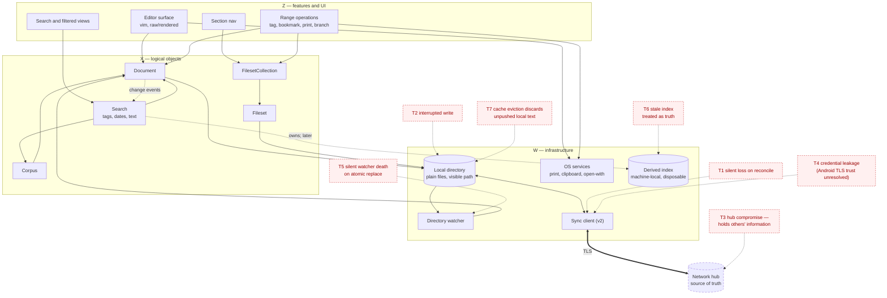

# Software architecture

Preliminary. This records the layering and the core objects; it is not yet a full design, and failure analysis has not been run.

> **For the map of what is actually built** — which module holds which
> responsibility, and where each contract between the layers is written down —
> see [architecture-as-built.md](architecture-as-built.md). This file is the
> *why*; that one is the *where*.

## The layering

Three layers, explicit in the code rather than implied by convention.

| | | |
|---|---|---|
| **Z** | Features and UI | The editor surface, the section nav, search and filtered views, range operations. Consumes X. |
| **X** | Logical objects | The natural objects of the domain — a document, a fileset, the corpus — exposing *conceptual* operations. Translates those into the language of W. |
| **W** | Infrastructure | Files on disk, directory watching, atomic replacement, OS services, and later the network hub. |

**The shell is Electron** (D17), serving the app from a **custom scheme** — not `file://`, not a localhost server. Z is a Chromium page with CodeMirror 6 at its centre (D16); W is the Electron main process plus the filesystem.

**This is not a stylistic preference here, because the most alarming finding Portal produced was a layering violation.** A widget that opened its file during view construction re-read constantly and lost edit state on reparenting — which is R1.2, *no state is ever at risk*, failing at the framework level rather than in application logic. Model construction being separate from view construction is the same rule as Z never reaching into W.

## Two file systems, and the map between them

**This is the pattern the whole design rests on, and it belongs at the front
rather than being discovered on the way** (added 2026-08-27, D54).

There are two file systems here, not one:

| | **W's** | **X's** |
|---|---|---|
| What a "file" is | bytes in a store — local disk now, a git object store beside it, a sync peer later | a **logical document** |
| What you get back | a path and a way to read and write bytes | a **`Document` subclass**, speaking that kind's own language |
| Primitives | stat, read, write, watch, commit, restore | borrow, list, create, rename, remove |
| Named | `Notebook` and `Repository` | **`Corpus`** |

**The map between them is not one-to-one, and that is the point.** One logical
document may be:

- **one physical file** — a note, a fileset;
- **many** — the stream, whose days are files and whose long days are split into
  parts (D8, D20), all of it invisible above the storage layer;
- **none at all** — a document that exists only as a computation. A filtered
  view (`goal/scope.md`), a saved query, or a day that has been navigated to and
  never written in, are all documents with nothing on disk yet or ever.

An X-layer file system that handed back byte handles would be W with extra
steps. What makes it the X layer is that **what comes back is an object that
knows its own kind**: a stream answers about days, a fileset about entries, a
markdown file about neither, and all three answer about text, positions and
edits.

## The invariant stack

Three rules, each one a floor the layer above stands on. Stated together because
they are one idea at three depths, and because **two of them can be asserted by
a test rather than remembered** — this codebase has already learned that a
comment saying "do not import Electron here" does not prevent the third
violation (`tests/unit/main/no-electron.test.ts`).

**1. The front end touches files only as documents.**
A window hosts a pointer to a `Document`; an editor is chosen by that document's
kind; nothing in the renderer reads or writes a path. *Enforced by:* the
renderer has no filesystem to reach — the process boundary does it for us — plus
the kind registry, which makes "which editor" a lookup rather than a decision
anyone makes twice.

**2. X touches corpus content only through documents, and gets documents only
from the `Corpus`.** Indexing, history, filesets, search: all of them ask a
document.

**X has a floor, and it is a directory rather than a rule to remember.**
`x/documents/` holds the `Corpus` and the per-kind implementations, and is the
only X code permitted to see the corpus's file system; everything else in `x/`
is built on documents. *Enforced by:* a test over the import graph — nothing
outside `x/documents/` imports `w/notebook.ts` — which needs no allowlist and
stays true as kinds are added.

**Not called X1 and X2.** Those name a position rather than a thing, and this
project has twice paid for a name that did not say what it was (D35's `Window`,
D48's coordinates). The floor is *the documents*; what stands on it is
everything else.

**Two exceptions, both narrow and both named:**

- **Machinery is not corpus content.** The index's cache, the WAL and the lock
  are `.tephra/` state that never becomes a document, and the code that owns
  them talks to W directly. Written down that is three things; left implicit it
  is however many places somebody found it convenient.
- **The version store is a different W service.** `History` legitimately reaches
  `Repository` to read the log and to commit — that is not the corpus's file
  system, and no document could answer it. **But anything that writes corpus
  CONTENT goes back through documents**, which is exactly why a restore reloads
  what it rewrote (D54) rather than checking files out from under an open
  buffer.

**3. The lower part of X reaches W through a narrow, named set of paths.**
Today that is `Notebook` (files) and `Repository` (versions). The eventual shape
is a W-level analogue of the `Corpus` — one object that IS the file system, with
the same two-guarantee discipline — at which point invariant 3 becomes as
checkable as invariant 2. *Enforced by:* nothing yet, which is why it is written
down as a direction rather than as a rule.

## The X objects

| Object | Exposes | Its storage implementation handles |
|---|---|---|
| **Document** | The markdown text; the anchors, tags and headings within it; edit and save | Segmentation into day files for the stream, or a single file for a branched document or pinned list |
| **Corpus** | The set of documents; enumeration; anchor resolution by name | Opening documents by name |
| **Fileset** | Typed entries — bookmark, file, URL, external document — in order | One index file |
| **FilesetCollection** | Iteration over all filesets; **updating a reference globally across them** | Writing the individual fileset files |
| **Search** | One query mechanism over tags, dates and text (D9), returning ranges | v1 scans through the Document API; later maintains an index, fed by Document's change events |
| **Range** | A selection, and the operations on it: tag, bookmark, print, branch | Transient — a *persisted* range is inline markup, never offsets (D11) |

**Document is one interface with one implementation per KIND** (D54) — markdown,
fileset, stream, and whatever arrives later. That is a good fit for D8: the
stream's day-file split genuinely becomes invisible above the storage layer,
which is what makes "the notebook is one document" true in code rather than only
in description.

## A kind arrives in four parts, in four predictable places

Kinds are the axis this design expects to grow along, so the four artifacts each
one needs have fixed homes. **Adding a kind should be adding files, never
finding them.**

| Part | Where | What it is |
|---|---|---|
| **the API** | `shared/kinds/<kind>.ts` | what this kind adds beyond `Document`, as types both processes share |
| **the implementation** | `main/x/kinds/<kind>.ts` | the real one: reaches W through the `Corpus`, owns the file's parsing and writing |
| **the forwarder** | `renderer/src/x/kinds/<kind>.ts` | the same API over IPC, holding whatever must be answered synchronously (D37) |
| **the surface** | `renderer/src/editor/kinds/<Kind>.tsx` | how it is edited and shown; markdown is the default, and a kind opts out |

Plus **one line in each process's registry** — kind → implementation, kind →
surface — so the lookup is data rather than a switch that someone forgets.

**Split by process first, kind second, and not the other way around.** Putting
all four files for a kind in one directory reads better and would let main-only
code into the renderer bundle by an ordinary-looking import: this project has
had three test suites broken exactly that way, and keeps a test whose only job
is to catch it (`tests/unit/main/no-electron.test.ts`). The process boundary
stays physical; the kind axis lives inside it.

## Six rules that keep the layering honest

**1. The split rule is specified by the format and merely implemented by storage.** D8 established that split points must be deterministic and content-derived, because merge sees them. Putting segmentation inside Document's storage implementation is correct, but it is exactly the arrangement in which the rule would quietly drift toward being size-based and runtime-chosen. The rule belongs to the format spec; the storage layer obeys it.

**2. A conceptual operation is a single X operation, not a Z-layer composition.** Branching is create-new, update-references, delete-from-source, **in that order**, because the ordering is the only safety mechanism available without a cross-object transaction (D13). If Z assembles it from three primitives, the guarantee is gone and the failure mode is dangling references. `branch(range)` is one call.

**3. X owns the quiesce protocol.** Before anything outside the app mutates the tree — sync in v2, or the user editing in another program — the sequence is flush, release, mutate, reload. X is the only layer that knows both about in-flight edits and about files, so it is the only layer that can enforce it. Skipping the first phase silently clobbers unsaved work.

**4. Search is an X-level component with a swappable implementation, never a W-level scan.** The tempting optimization is to grep the directory directly. It is wrong for four reasons, any one of which is sufficient. **W does not know which file on disk holds a given part of the notebook** — that mapping belongs to Document's storage implementation, so a W-level result cannot be expressed as a position in the logical document. **W does not know the format**, so a raw scan matches frontmatter keys, tag markup and anchor syntax as though they were prose — the "don't contort a file format to suit a generic algorithm" rule, inverted. **A W-level hit is a file and a byte offset**, which is precisely the address D11 forbids. And **unsaved edits live in X's in-memory buffer**, so a disk scan cannot find the paragraph just typed.

The performance worry that motivated the shortcut does not materialize before its own fix does: v1's corpus scans in milliseconds, and by the time scanning is slow enough to notice, the index has arrived on its own merits.

**Two implementations behind one interface.** v1 reads through the Document API and scans. Later, Search maintains an index, kept current by Document — and the direction of that coupling matters: **Document emits change events and Search subscribes**, rather than Document calling Search. Document stays ignorant of its consumers, so a second index later (backlinks, tags) needs no change to it.

**An incrementally-maintained index needs a repair path or it becomes T6.** Events can be missed, an update can be interrupted, and a file can be hand-edited while the app is closed. The watcher covers hand-edits made while it is running; a **cheap consistency check at startup, with full rebuild on disagreement**, covers the rest. D7 already makes the index disposable, which is what makes rebuilding the correct response rather than a repair.

**5. Directories are watched, never file descriptors.** An fd-based watcher dies *silently* when a file is atomically replaced by rename, which is how every well-behaved writer updates files — including our own atomic writes. It stops firing without erroring, and the editor and the disk drift apart.

**6. Strict for operations, loose for live state.** R1.1 is a hard latency requirement, and an editing surface routing every keystroke through Z→X→W will not meet it. The live buffer is held in memory and the editor renders directly from it; X persists asynchronously (autosave), and W writes atomically. The layering governs *operations and persistence*, not the read path for state already in hand. A naively strict version of this architecture would violate the project's primary requirement.

## Structure and trust boundaries

Everything above the dashed link to the hub is on a trusted device; the hub is the only component outside the user's physical control, and it holds other people's information (a stated constraint in `goal/requirements.md`).

## Preliminary risks

Not the output of failure analysis, which has not been run and is **deliberately deferred until v2a begins** (D36) — these are the ones already visible from decisions taken. **T10 is the one v1-relevant item that coding will not illuminate**; it is bounded by v1 having no remote, so the purge procedure is owed before the first *push* rather than the first commit.

| | Risk | Why it ranks | Mitigation so far |
|---|---|---|---|
| **T1** | Silent loss when divergent copies reconcile | "Losing anything, ever" is an explicit unacceptability criterion | Divergence surfaced with a picker, never resolved silently (D12) |
| **T2** | Interrupted write corrupts a day file | Autosave makes partial writes the ordinary risk, not the exotic one | Atomic write-temp-then-rename |
| **T7** | Cache eviction discards text not yet pushed | The replica/cache confusion is the failure D5 exists to prevent | Text is a replica and never evictable; only attachments are cached |
| **T5** | Watcher dies silently on atomic replace | It fails *without erroring*, so nothing reports it | Watch directories, never descriptors |
| **T3** | Hub compromise exposes third-party information | Notes discuss people who did not consent to the hub | Open — bears on where the hub lives (Q2) |
| **T4** | Credential leakage; Android TLS trust unresolved | Portal's one unclosed hole, inherited | Open — carried from Portal's T5 spike |
| **T6** | A stale derived index is trusted | Hand-editing is a feature, so staleness is routine | Index is machine-local, disposable, never authoritative (D7); startup consistency check with full rebuild |
| **T8** | A local HTTP server inside the app is reachable by any other process on the machine | The corpus holds other people's information, so a localhost origin is a real exposure, not a theoretical one | Avoided by design: the app serves itself from a custom scheme, which needs no port and no listener (D17). **Do not substitute a dev server for convenience.** |
| **T9** | The vim keymap's only mature implementation ignores CodeMirror's atomic ranges | Two of D16's three constraints exist to work around it; if it is abandoned or fixed, behaviour shifts underneath | Low severity — the workaround (unrender under the cursor) is arguably correct behaviour independently |
