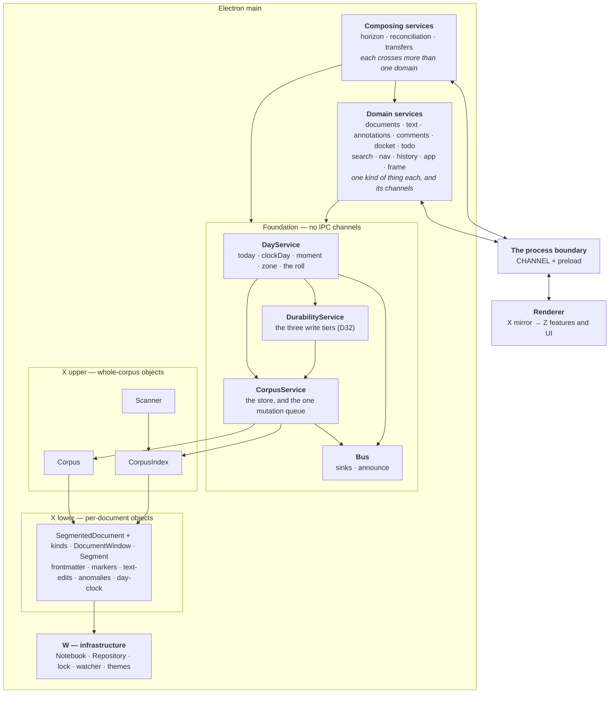

# Service layers — splitting `DocumentService`

**Status: the foundation is built** — `Bus`, `CorpusService`,
`DurabilityService`, `DayService`, `FixedPoints` — and reconciliation runs on it.
Next is the first domain service; the plan is under *Order of work*.
`../architecture-as-built.md` describes what *is*; this describes what we are going
to do, and each piece moves into that file as it lands. Decided in D83. Progress
is tracked under *Order of work* at the foot — **1a is done**, and nothing above
the core has moved yet.

## Why

`DocumentService` is 2,805 lines and 150 members across twelve internal
sections. Size is the symptom. **The cause is that it holds three layers at
once**, so every flow in it has a free hand on everything else, and nothing in
the type system or the file structure says which reaches are legitimate.

The evidence that this is structural rather than cosmetic: **docket and todo
already call each other.**

- `todoPutDown` → `docketAdd`, `matterFor` — todo reaches into docket
- `#reconcileDocketsOnce` → `todoList`, `todoItems`, `todoAdd`, `todoRemove` —
  docket reaches into todo

A flat set of peer services would be mutually dependent on the first day. So the
split is not *which verbs go where* — it is **which layer each thing is on**, and
the cycle is what proves the layers exist.

## The seam

The split follows the **IPC channel boundary**, because that boundary is already
real: everything crossing it is plain data, so every service contract is narrow
and testable by construction. The shape is proven twice in-tree — `docket` and
`todo` are single channels carrying a command union, and both were pleasant to
extend, where the other 69 channels are one-per-verb and cost four file edits
apiece to add to.

**Each channel is registered by exactly one service.** A service may own several
channels; a few own none, being pure readers.

## The layers



**Corpus and CorpusIndex are peers**, both built over the notebook and both
reaching the same per-document objects — which is why they belong to one layer
and why `CorpusService` is the single interface onto the pair. `Scanner` is
X-upper too but is **not** its: only search uses it, so the search service owns
it.

## The rule

> **The dependencies form a DAG.**

That is the whole constraint. The tiers in the diagram are a coarse reading aid,
not the rule — **the number of layers does not matter and neither does the number
of services**; what matters is that each service's scope is nameable in a phrase
and that nothing points back up. **Every file names its tier and what it may
depend on in its opening comment**, so the reach a file is allowed is legible
before reading a line of it.

**Numbered levels were the first draft and they broke twice.** Durability and the
day both need the corpus, which as numbered peers would have been a forbidden
sideways call; and *which rung* a foundation service shares with a domain service
is not a meaningful question. Acyclic answers both.

**Foundation services own no channels.** A channel is something the renderer has
a name for, and there is nothing on the far side of the fence that corresponds to
a corpus or a queue — the UI has no reason to talk to anything that low. So the
whole foundation is invisible from the renderer, and exists to be depended on.

**Lower things emit; higher things subscribe.** `corpus.onChanged → touched()`
reads like the corpus reaching up into durability, and it is the reverse:
durability asks the corpus to tell it. The dependency points down while the news
travels up. This is the second place the pattern has been the answer — the
reconciler is the other — which makes it the general rule here rather than one
trick.

This is what breaks the docket/todo cycle honestly: docket stops knowing about
todo, todo stops knowing about docket, and the three flows that genuinely span
both move up to where spanning is the job.

**That layer-2 list is not arbitrary** — the horizon, the reconciler and the
transfer gestures are the three features that produced the most design
discussion in the last fortnight, and they are the three that were structurally
homeless. D78 already says the horizon is its own object *implemented by* its
sources; this gives that sentence somewhere to live.

## The foundation's four contracts

One each, and each nameable in a phrase — which is the test the single
`CoreService` was failing:

1. **`Bus`** — where a pushed message goes. Depends on nothing, which is what
   lets the other three use it without depending on each other.
2. **`CorpusService`** — *the corpus, and the discipline for writing to it*: the
   store, and **one** mutation queue. The queue is why this class must exist at
   all, because **idempotence has to hold concurrently, not merely repeatedly**
   (note 51 — two overlapping passes generated the same task). A second queue
   anywhere would break that silently, and a data race is the failure the tests
   are worst at catching.
3. **`DurabilityService`** — the three write tiers (D32), each *quiescence OR a
   ceiling*, never quiescence alone.
4. **`DayService`** — what day the app is filing into, and the notebook's zone
   (D62, D63). **Not the zone *offer***, which is session UI state and belongs to
   the app service: D63's rule is that the zone is offered and never applied, so
   the offer is not a fact about the notebook at all. The `zone` itself is here
   because it is an input to date *arithmetic* — `dueOn` is zone-aware, and
   getting that wrong is what made a task finished at 17:42 in a GMT+8 notebook
   come due "tomorrow".

**Where `reconcile()` goes, and the inversion it forces.** Reconciliation is a
*composing* service — it reads dockets and writes the task list — so it sits at
the top of the DAG, while `wrote()` is the ordinary end of every verb down in the
foundation. The foundation therefore cannot call it. Services **register** passes
instead:

```ts
reconciles(name: string, pass: () => Promise<unknown>): void
reconcile(): Promise<Record<string, unknown>>
```

run serialised and never re-entrantly, by something that knows nothing about what
the passes do. D77 says `reconcile()` is *make all derived state true again*,
with dockets as its **first clause** — registration turns that phrase from a
comment into the structure, and a second clause costs a registration rather than
an edit to the reconciler.

**Still open: who holds the registry.** It cannot be `CorpusService`, whose scope
is the store and the queue. A fifth foundation service for it would be a class
holding one array. The likeliest answer is that the pass queue belongs to the
reconciliation service itself, and the verbs that want a pass after writing ask
*it* — which makes the edge point up from domain to composing, and that is legal
in a DAG as long as nothing comes back down. To be settled when 1d is built.

## The naming fault to fix on the way

`tephra:win:` currently means two different things: `CHANNEL.edit` is a **text
window** and `CHANNEL.windowInfo` is an **OS window** (MC6). Two senses of one
word under one prefix will make the service names ambiguous the moment they are
written down. The vocabulary splits: **text** for the buffer, **frame** for the
OS window.

## The channel grouping

| service | tier | channels | owns |
|---|---|---|---|
| **Bus** | foundation | — | sinks |
| **CorpusService** | foundation | — | Corpus, CorpusIndex, the stream, **the mutation queue** |
| **DurabilityService** | foundation | — | the three write tiers (D32) |
| **DayService** | foundation | — | the clock, the notebook's zone |
| **documents** | 1 | open, read, new, rename, duplicate, delete, importText, branch, linkBase, openLink, print, attachImage, chooseImage | lifecycle and identity |
| **text** | 1 | edit, release, extend, flush, undo, redo, spans, proseIn, extent | windows, desync |
| **annotations** | 1 | tag, untag, renameTag, setAnchor, removeAnchor, resolveAnchor | — |
| **comments** | 1 | 8 → one union | — |
| **docket** | 1 | docket | — |
| **todo** | 1 | todo | — |
| **search** | 1 | searchOpen/Next/Close | Scanner, the cursors |
| **nav** | 1 | 13 `nav:*` | — (reads core's index) |
| **history** | 1 | versions, readDay, restore | StreamHistory |
| **app** | 1 | today, anomalies, zone×3, clipboard, emoji, quit, uiState×2, themes×3 | the zone offer, UI state |
| **frame** | 1 | windowInfo/Create/Reveal/Close/Import/Report | the window set |
| **horizon** | 2 | horizon | — (calls docket and todo) |
| **reconciliation** | 2 | — | registered with core |
| **transfers** | 2 | — | put-down, move-to |

Twelve of these own state; four are thin routers over objects that already exist
as modules (`searches.ts`, `windows.ts`, `CorpusIndex`, `Repository`), which is a
useful result on its own: a good part of the 2,805 lines is delegation that can
leave the file without a single design decision.

## Where the files live

**`main/services/`**, added 2026-09-14 once the foundation was built and before
the ten or so domain and composing services land in the same place.

**Deliberately not the whole reorganisation.** `x/` still mixes its two halves —
`corpus.ts`, `corpus-index.ts` and `search.ts` are X-upper while `segmented.ts`
and `stored.ts` are X-lower — and the layering test keys its floor rule off that
prefix, exempting everything under `main/x/` as *sideways within X*. So **an
upward edge inside X is not currently caught**, and there are two: `x/fileset.ts`
and `x/history.ts` both import `documents/corpus.ts`. Both merely *take* a
`Corpus` as a parameter, which is closer to injection than to a violation — but
the point is that the test cannot tell, because the directories do not match the
layers. Splitting them is the next reorganisation, and it makes that rule precise
rather than merely tidier.

The order matters: the extractions will add files to `main/services/`, so
reorganising `x/` first would mean doing it twice, with the bigger pass second.

**W, X and Z stay as letters.** They are borrowed nomenclature — [*W, X and Z:
the layers of a
system*](https://betterprogramming.pub/w-x-and-z-the-layers-of-a-system-568cf6b1477c)
— rather than local jargon, so renaming them to words would lose the reference.

> **One gain arrived immediately.** *No service imports Electron* was a list with
> one filename on it, and every service written since would have had to be added
> to it by somebody remembering. It is now stated over the directory, so a new
> service is covered by existing.

## Order of work

1. **Core first**, extracted whole, with `DocumentService` left calling it. No
   service moves yet, so the acceptance suites are the proof the extraction was
   faithful.
   - **1a done, 2026-09-13** — `main/core-service.ts` holds the store (`Corpus`,
     `CorpusIndex`, the stream, the notebook), the **mutation queue**, and the
     bus (`addSink`, `announce`, `changed`). `DocumentService` constructs it and
     reaches it through forwarders under the old private names — `#corpus`,
     `#stream`, `#index`, `#serial` — so **no call site moved**. There are
     sixty-eight `#serial` calls alone; rewriting them in the change that moves
     the queue would have meant proving two things at once, with the suites
     unable to say which had gone wrong. The forwarders go as each service is
     split out and starts naming `#core` directly.
   - **1b done, 2026-09-13** — the three write tiers (D32): the WAL, the file
     tier, the version tier, plus `flush`, `stop`, `recover`, `saveVersion`,
     `openHistory` and the `history`/`repository` accessors. **The four corpus
     and notebook subscriptions moved with them** — the journal, the change
     watch, the external-change reload, the divergence notice — because they are
     what *feed* the tiers, and leaving them behind would have meant the core
     owning the tiers while something above it decided when they fired.
     `DocumentService` went 2,805 → 2,495 lines; the core is 553.
     - Three `#scheduleFlush()` callers — `edit`, `undo`, `redo` — wanted the
       file timer **without** marking unversioned work, so that became
       `core.writeSoon()` rather than being folded into `touched()`. An undo
       that puts a document back exactly as it was found should not tell the
       version tier there is something to commit.
     - The history *reads* — `versions`, `readDay`, `restore` — stayed put.
       They are the history service's, layer 1, not durability.
   - **1c done, 2026-09-13** — `DayService`: the clock, the seed, the poll, the
     boundary, `today` / `clockDay` / `moment` / `zone`. **Two upward edges were
     inverted on the way out**: crossing a boundary has to reconcile what derives
     from the day, and every poll has to re-offer the zone — both far above the
     day — so the service emits `onRolled` (awaited, because the boundary is not
     crossed until derived state agrees with it) and `onChecked`, and the callers
     subscribe. The **zone offer** — `zoneNotice`, `dismissZone`, `askZoneNotice`
     — deliberately stayed behind: D63 says the zone is offered and never
     applied, so the offer is session UI state and belongs to the app service.
     The `zone` itself went, being an input to date arithmetic.
     - **And it closed a real defect** (note 61). The comment above the clock
       claimed *every door awaits `#seeded` first*; six of ~150 did, and
       `todoAdd` was not among them, so a write racing startup filed under the
       guessed day while every read looked under the real one. Gated at the
       mutation queue — the one place every write already passes through — plus
       five doors that read the day before queueing. Pinned by *THE SEED LANDS
       BEFORE A WRITE PICKS A DAY*, which fails without the gate.
   - **1d done, 2026-09-14** — `main/fixed-point.ts`, and the reconciler moved
     onto it. Three exports: `FixedPointFunction` (the API — a name, a trigger,
     a pass), `FixedPoints` (the table and the routing), `DivergenceReport`.
     - **Two classes, because two jobs.** `FixedPointRunner` (internal) runs one
       function and owns its queue, rounds and threshold; `FixedPoints` holds the
       table and routes keys. State is per function; **execution is not** — two
       functions reading and writing the same document race exactly as two
       copies of one did (note 51), so a turnstile the table owns is shared.
     - **Re-entrancy by `AsyncLocalStorage`, not a flag.** A flag is true for a
       pass's whole *duration*, and other work interleaves in that window — so a
       second window's write would be told *you are inside the work* and return
       without waiting, which is the `docketActivate` bug under a race. Proven:
       the boolean version fails exactly one test, written to settle it.
     - **Keys come from the corpus**, which reports every write as
       `<kind>:<id>`; no write site remembers anything. `#wrote` asks again with
       the same key to get the *waiting*, and asking twice is free because a key
       repeated inside one round is one key.
     - **The trigger names what the clause reads**, which is more than the
       dockets: `'^(docket|todo|asked):'`. The task list is an input — it says
       which generated items are still outstanding — so `todoSetStatus`'s
       remembered `await this.reconcile()` became routing. And `asked:` is the
       synthetic key for startup and the day boundary, so there is one path in
       rather than a side door.
     - **Divergence is counted in rounds, not reports.** A recurring matter whose
       notebook was shut for a year advances through every missed interval —
       hundreds of writes to one field, all in one round. Limit 25; an ordinary
       recurring flow measures **2**.
2. **Channels declare themselves — done 2026-09-14.** `services/serves.ts`:
   a service returns `Served[]` from `serves()`, and `ipc.ts` walks the
   declarations.
   - **Declared, not registered, because of the Electron rule.** A service may
     not import Electron — checked by directory — so it cannot call
     `ipcMain.handle` for itself. The same inversion as everywhere else, applied
     to the process boundary.
   - **`claim()` is separated from the wiring so it can be tested.** `ipc.ts`
     cannot run under plain Node; who claims what, and what happens when two
     services want one channel, is the part worth a test.
   - **It makes one of this decision's rules mechanical.** *Each channel is
     registered by exactly one service* was a sentence here; `claim` throws on a
     collision, at startup, before a window opens.
   - The comment channels declare themselves already, one step ahead of the
     code, so the extraction has that much less to do. **74 → 67** hand-written
     handlers.
2a. **A completeness test over the channels — done 2026-09-14.**
   `tests/unit/main/channels.test.ts` relates the three sides that nothing else
   relates: a channel is *declared* in `shared/ipc.ts`, *asked for* in
   `preload`, and *answered* in `main`, and the three refer only to the same
   string constant — so TypeScript cannot see a gap in any direction.
   - asked and not answered → the renderer waits for ever, silently
   - answered and not asked → dead code that reads as live
   - answered twice → the migration hazard: a service declaring a channel whose
     hand-written case was not deleted. Electron refuses the second handler, but
     only at startup
   - declared and neither asked nor listened → a channel nobody uses
   - pushed by main and not listened for → a message into the void
   All five hold today (91 declared, 79 answered, 79 asked, 13 listened), and
   both failure modes were **checked by breaking them**: deleting one handler
   and double-declaring one channel each failed the expected test by name.
   - **Chosen over a `@ipc` decorator.** TS 7 and esbuild 0.25 do support
     standard TC39 decorators — compiled and ran one to be sure — and the
     decorator's one real advantage is that a verb cannot be added without its
     channel. But `serves()` is one place to read to answer *what does this
     service expose*, which is the question D83's one-channel-one-service rule
     makes important, and a decorator scatters that across thirty methods. The
     completeness test buys the safety without the scatter, and catches the
     opposite failure a decorator cannot see.

3. **Comments as the pilot — done 2026-09-14.**
   `services/comments-service.ts`, 120 lines: eight verbs and their eight
   channels. Chosen because it **writes**, so the move exercised the store, the
   one mutation queue and the write tiers rather than only the channel
   declaration — `nav` would have deleted more of the switch and proved less.
   - **Nothing else in main called the comment verbs**, so nothing forwards to
     them and `DocumentService` lost them outright. It builds the service,
     because it owns the foundation nothing else can reach yet, and exposes
     `services()` for `ipc.ts` to wire. When the last group has gone, what
     builds the foundation moves up to `index.ts`.
   - **One deliberate behaviour difference**, stated because a move is supposed
     to have none: the verbs used to pass through `DocumentService.#serial`,
     which awaits the day being seeded. Comments are anchored to a *span* and
     the span names its segment, so this service does not depend on `DayService`
     and its writes do not wait on the clock. Nothing observable changes; a
     comment written in the first moments of startup no longer waits for a fact
     it does not use.
   - **Eight channels, not one union.** `docket` and `todo` carry a command
     union and these could too, but that is a change to the preload and the
     renderer, and does not belong in a move.
   - **A bug found and deliberately not fixed here** — see below.

### Found while extracting: a comment's timestamp is wall-clock UTC

`#newMessage` in `x/documents/segmented.ts` stamps a message with
`new Date().toISOString().slice(0, 16)`. Everywhere else in the app both the
instant and the zone come from `DayService` (D62, D63), and this is the **third**
of that family — completion stamps taken from the wall clock while `today` came
from the service, and `dueOn` computing in UTC so that a task finished at 17:42
in a GMT+8 notebook came due *tomorrow*. Both were fixed by passing the clock
and the zone in.

Visible consequence: a comment written after midnight in a notebook whose zone is
behind UTC is stamped with the previous day. And under a frozen test clock the
stamp is the real time, so no test can assert on it.

**Fixed 2026-09-14, as its own change** rather than inside the move — every step
in this plan changes no behaviour, which is what lets the suites be the proof,
and a fix bundled into a move spends that property.

- `shared/dates.ts` gained **`stampAt(at, zone)`** → `2026-09-14T10:23`, beside
  `dateKeyAt`. A separate `Intl` formatter, cached like the other, with
  `hourCycle: 'h23'` — `hour12: false` yields **24**:00 for midnight in several
  engines, which is the classic way to get this wrong.
- `DayService` gained **`stamp`**, beside `moment`, for the same stated reason:
  a stamp from the wall clock while everything else comes from the service is
  two sources of truth about one instant.
- `SegmentedDocument.startComment/addComment` take `at` as a **required**
  parameter, so a caller cannot quietly get the wall clock back. The
  `DocumentApi` interface and the renderer's mirror follow.
- **The comments service therefore does know the day after all** — not to pick
  one, but to write the byline.

> **And the tests got better rather than merely longer.** *a thread reads back
> with its author, time and body* could only assert the stamp's **shape**
> (`/^\d{4}-\d{2}-\d{2}T/`) while it came from the wall clock; it now asserts the
> exact instant it was given. The one thing a test could not see is the thing
> the bug lived in.
4. **The rest — in progress.**
   - **`history` and `search` done 2026-09-14.** `HistoryService` (3 channels);
     `SearchService` (3 channels) which **owns the `Scanner`**, since nothing
     else uses it, and `searches.ts` moved into `services/`.
     - Search needed one mechanism: **`serveAsked`**, which hands the answer
       *which window asked*, as a **number**. A cursor belongs to the window
       that opened it — two windows searching are two walks through the corpus —
       and a number rather than a `WebContents` keeps Electron out of a service.
   - **`frame` was removed from this plan here and came back at step 8.** Four of
     its six handlers pass `e.sender` — the `WebContents` object — to
     `windows.ts`, which imports `BrowserWindow`, so it read as Electron
     furniture like `menu.ts` and `print.ts`. Two things were wrong with that:
     the taxonomy had not named the tier such furniture lives on, and the
     handlers do not actually want a `WebContents` — only the id inside it.
   - **`serveKinds` for the union channels.** `docket` carried a 34-case
     `switch` in `ipc.ts` and `todo` a 19-case one; a map of handlers says the
     same thing **exhaustively** — adding a command to either union is a compile
     error until it is handled, verified by leaving an arm out. Each arm receives
     the command narrowed to its kind. Both channels are declared by
     `DocumentService` now, a step ahead of their code, as the comment channels
     were.
   - **Capture moved to its own channel** (`tephra:todo:capture`). Three arms of
     the `todo` union hold a `WebContents`, so while they shared a channel with
     the list's verbs that channel could not be wholly a service's. It produces a
     task, which is why it lived there; what it *is* is a gesture between two
     windows. **No renderer change** — the preload is the seam.
   - `ipc.ts`: **471 → 342 lines, 74 → 48 hand-written handlers.**
   - **`docket` and `todo` done 2026-09-14.** `DocketService` (503 lines, 33
     verbs) and `TodoService` (233, 15). `DocumentService`: **2,374 → 1,883**.
     - **The boundary was the interesting part.** Three verbs reach across and
       stayed above both: `todoSetStatus` (a completion has to tell the step
       that asked for it), `todoBulk` (the same, in bulk), and `matterFor`
       (which means reading every docket). `todoPutDown` stayed for the same
       reason. That is what lets the two services not know about each other.
     - **`docketSuspend` lost a redundant `reconcile()`.** It called `#wrote`
       and then reconciled again — right when only listed verbs reconciled, and
       doing the work twice since every docket write reports its key and waits
       (D83). It was also the last thing keeping that verb cross-domain.
     - **The methods keep their `docket`/`todo` prefixes**, so calls read
       `service.docket.docketAdd(…)`. The prefix distinguished them inside one
       enormous class and now says twice what the accessor says once; stripping
       it is a rename across some four hundred call sites and belongs in its own
       change rather than in the move that made it redundant.
5. **The agenda — done 2026-09-14** (D84). `agenda-service.ts`, 741 lines: the
   construct, over `Dockets` (496) and `Tasks` (228).
   - **Its three faces**, all moved together because they are one concern: the
     reconciliation pass (`reconcile`, `#reconcileDockets`, `#advanceDocket`,
     `#setStepMade`, `#registerReconcilers`), the cross-form writes
     (`todoSetStatus`, `todoBulk`, `todoPutDown`, `#finished`), and the
     cross-form reads (`horizon`, `matterFor`).
   - **It declares both unions and the reconcile door**, per the settled answer
     to question 1: the composite declares the user-facing verbs. `Dockets` lost
     its `serves()` and now answers no channel at all — which is the mark of a
     store.
   - `DocumentService` is **2,805 → 1,238** and holds what is left: windows and
     the text contract, the file lifecycle, UI state, the zone offer, and the
     remaining hand-written channels.
8. **The shell tier, named, and `frame` is a service after all.** `git mv` of
   `ipc.ts`, `menu.ts`, `print.ts`, `scheme.ts`, `verify-mode.ts` and
   `windows.ts` into `src/main/shell/`, then `FrameService` declaring all six
   window channels.
   - **It needed no exemption in the end.** The four verbs that looked like the
     reason a frame service was impossible took a `WebContents` and read nothing
     from it but `sender.id` — `Windows` has always matched windows by id and
     keyed its registry `Map<number, Entry>`. They take the id, and the service
     declares them with `serveAsked` like any other. **The Electron object never
     crosses the boundary**; the tier's licence is spent on one line, the push
     to a revealed window.
   - The layering test now states *NO SERVICE imports electron* over the
     **directory** `main/services/`, so the rule covers services not yet written
     rather than a list of names to remember to extend.
   - Two path assertions moved with the files (`keymap`'s read of `menu.ts`, the
     composition list's `print.ts`), which is the layering tests doing exactly
     the job they were written for.

9. **The prefix strip.** `docketAdd` → `add`, `todoItems` → `items`, 48 names
   across some four hundred call sites; `dockets()` → `all()` and `todoList()` →
   `list()` where the plain strip left nothing. Mechanical, and typecheck caught
   both places it over-reached: `CorpusIndex.todoTags` is not a store method and
   two structural type literals in the docket suite name the methods they
   expect.

10. **Everything lives in a service** — asked of the twenty-four handlers still
   in `ipc.ts`: *do any of these belong here?* None did.
   - **`horizon` was simply misfiled.** A bare forward into `AgendaService`,
     which is the composite that declares the user-facing verbs (D84) — the only
     one of its three faces it did not declare, for no reason but the order the
     extractions happened in.
   - **Five new domain services**, each a real noun rather than a bag of
     leftovers: `TextService` (a window over a buffer — the *text* half of the
     word D83 split, `FrameService` being the *frame* half), `MarksService`
     (bookmarks, subjects, branches — everything written *over* a span),
     `LibraryService` (documents as files), `IntakeService` (what arrives from
     outside), `SessionService` (the day, the zone offer, where the reader was).
   - **Two shell services**: `DesktopService` (the clipboard, the dialog, the
     printer, the emoji panel, opening a path) and `CaptureService`. The second
     is the argument for the whole exercise: `waiting` and `claimed` were
     **mutable closure variables inside the registration function**, which is
     state nobody can reason about.
   - **`serveAskedKinds`**, the one mechanism that was missing: capture is a
     union channel whose every arm needs to know which window asked.
   - **The self-check channels became `shell/verify-ipc.ts`** — three of them,
     scattered over two files behind three separate gates. `verify-mode.ts` says
     *nobody audits a surface that has no name*; now the surface has one. The
     menu channel kept its **second** gate: collecting them must not quietly hand
     the narrow one the wide gate.
   - `ipc.ts`: **471 → 75 lines**, and it holds no verbs, no Electron beyond
     `ipcMain`/`BrowserWindow`, and no state.

11. **Two composition roots, one per tier.** `DocumentService` became
   **`NotebookService`** — it answers no channel, builds the foundation and the
   ten Electron-free services, and owns the notebook's lifecycle — and
   **`ShellService`** is its parallel above the tier line, building the three
   that need the machine.
   - **Not `DataService`**, which was the tidier symmetry and would have been a
     lie: that side holds the ordering guarantee on edits, reconciliation to a
     fixed point, the day boundary and the agenda. Naming behaviour *data* is the
     vagueness that made `CoreService` four objects.
   - **The pair makes the tier edge structural**: `ShellService` holds
     `NotebookService` and nothing holds a reference back. The layering test now
     says so twice — no service imports `electron`, **and no service imports
     `main/shell/`**, which is the same rule one indirection out, and the
     indirection is how the rule broke the third time.
   - `document()` went rather than being renamed: it returned the stream under a
     name that said document, and it had **no callers at all**.
   - And the comments were swept. A file's comments describe what it is, not
     what left it: `NotebookService` 1,238 → 355 lines, most of the difference
     code and a good part of it pointers to services that had already moved.

Nothing is left on this plan.

## The agenda, and what sits at each level (D84)

Not *layers* with numbers: **one logical service powered by two lower ones.**

### `AgendaService` — the user-visible construct

Everything that is about the construct rather than about a file. Declares the
channels, because it is the only thing that can answer all of them.

- **make it true** — `reconcile()`, and the pass registered with `FixedPoints`:
  `#reconcileDockets`, `#advanceDocket`, `#setStepMade`. This is the projection
  function from standing to asked.
- **change it** — `todoSetStatus` and `todoBulk` (resolving an item stamps the
  step that asked for it), `todoPutDown` (an item becomes a matter), `#finished`.
- **ask it** — `horizon(from, to)`, `matterFor(item)`.
- **later** — MH5's review flow and MH6's graveyard land here, being features of
  the construct rather than of the docket.

### `Dockets` — the standing store

The thirty-two verbs now in `docket-service.ts`, plus `#takenMatterIds` and
`scheduleFor`. Knows the matter grammar, the block format, and how to rewrite one
matter without disturbing its neighbours. Knows nothing about a task.

### `Tasks` — the asked store

The fifteen verbs now in `todo-service.ts`, plus `#takenIds`. Knows the line
grammar, the day a list is filed under, and carrying an item forward. Knows
nothing about a matter.

### The sanity check found three things

**1. Who declares the `docket` channel — settled.** `AgendaService` does, and so
does the task list's: **the composite construct declares the user-facing verbs.**
All thirty-two docket arms delegate today, so `Dockets` *could* serve that one —
but a store with channels contradicts *formats and files*, and a channel is a
thing the renderer has a name for, which makes it the user-visible construct's.
The cost is thirty-two one-line delegations, paid on purpose: those arms are the
agenda's verbs which happen to be implemented by a store today, and a verb that
later has to touch the task list then changes in one place without the channel
moving.

**2. `#wrote` was written four times — fixed 2026-09-14.** `DurabilityService`
now has `wrote(id)`; the four copies are one call each, and `CommentsService`'s
same-named helper — which mutates and touches but deliberately neither announces
nor reports — was renamed `#mutated`, because two operations sharing one name is
how the wrong one gets called.

Originally: `#wrote` was written four times — in `document-service`, `docket-service`,
`todo-service` and (a variant) `comments-service`: mark dirty, announce the
document, report the key. Triplication of a three-line invariant is the shape
note 61 records decaying. It has an obvious home: **`DurabilityService`**, which
already depends on `CorpusService` (and so reaches the bus) and can take
`FixedPoints` without a cycle. `durable.wrote(id)` would replace all four.

**3. `Store` is the wrong suffix — renamed 2026-09-14** to `Dockets` and `Tasks`
(`dockets.ts`, `tasks.ts`), not `DocketStore`/`TodoStore`. Every service already calls
`CorpusService` `#store`; a `DocketStore` beside `this.#store` would be two
meanings of one word. Plain nouns match the existing idiom — `Bus`, `Searches`,
`Filesets`, `Corpus` — and say *not a service* by their shape.

### And one thing the check confirmed

**The stores never learn that the agenda exists.** A store writes; the corpus
reports the key; `FixedPoints` wakes the agenda's pass. So the projection is
driven entirely by the inversion — *lower things emit, higher things subscribe* —
and `Dockets` has no reference to `Tasks`, nor either to `AgendaService`. That is
the property that makes the whole arrangement worth the move, and it already
works: it is how reconciliation is triggered today.

### The shell tier, which this plan had not named

**Raised 2026-09-14.** The rule as written is *no service imports Electron* —
which is a rule about a **layer** wearing the clothes of a rule about **all
services**. The honest version:

> The foundation and the domain services are Electron-free. **A shell tier above
> them is not**, and `windows.ts`, `menu.ts`, `print.ts`, `scheme.ts` and the
> capture gesture already live there, in `main/` root, unnamed.

Naming it makes three current facts obvious instead of surprising: `frame` **is**
a service that lives up there; capture belongs beside it; and `navOpen`'s split —
the service says where a reference points, the shell opens it — is a **tier
boundary** rather than a special case.

**What the Electron-free rule actually buys**, so the trade is visible: it is what
lets three integration suites drive the service under plain Node, and that
property has been broken three times by three imports each added for a good local
reason — `app.isPackaged` at module scope, `shell` for opening a link, `verifyEnv`
for a timing knob. Every service extracted today inherits that testability, which
is why these extractions have been verifiable at all. The cost, honestly counted,
is **one** distortion: the capture split — and that split was an improvement
anyway.

Enforceable the same way: `main/services/` Electron-free, `main/shell/` not, both
checked by directory.

**Done 2026-09-14, and it cost less than this section expected.** `frame` turned
out to need no Electron in its service at all (step 8 above), so the tier's
licence is used by `windows.ts`, `menu.ts`, `print.ts`, `scheme.ts` and one line
of `FrameService` — not by the six handlers that prompted the question.
5. **Layer 2 last**, because it is the part the cycle lives in, and by then both
   its dependencies are behind interfaces.

Each step ends green on `npm test` and the acceptance suites; none of them
changes behaviour.
