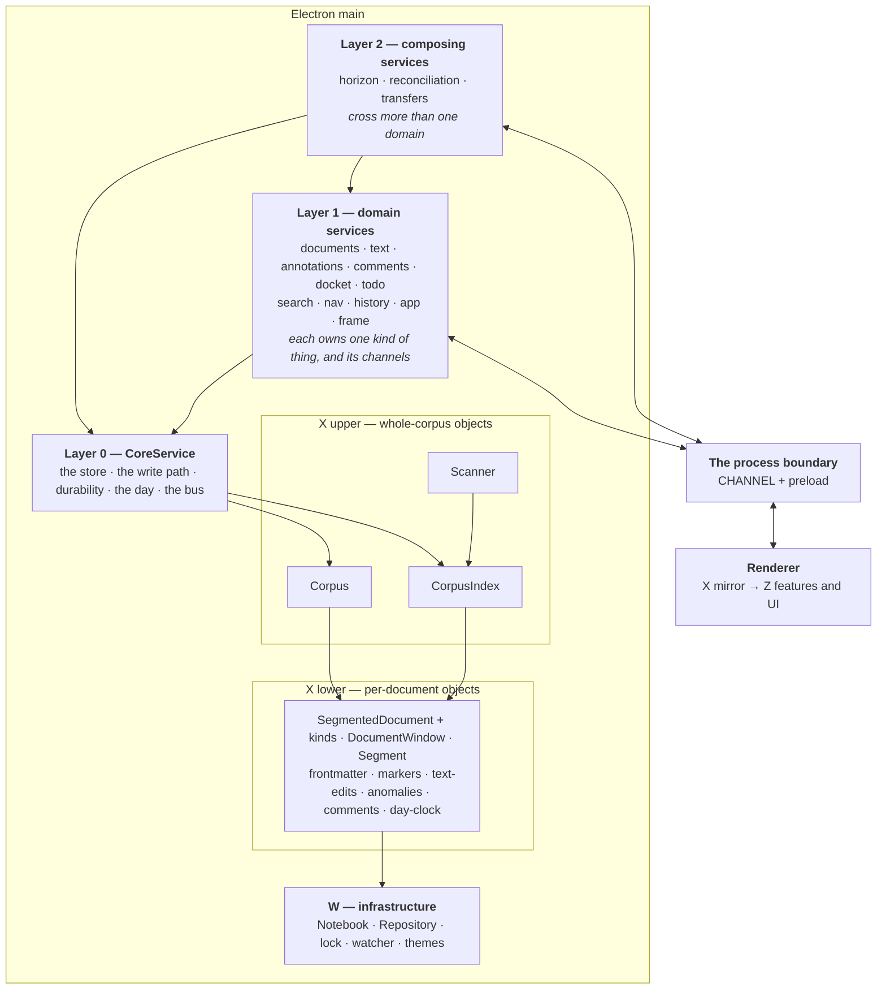

# Service layers — splitting `DocumentService`

**Status: designed 2026-09-13; the core's first slice is built.**
`architecture-as-built.md` describes what *is*; this describes what we are going
to do, and each piece moves into that file as it lands. Decided in D83. Progress
is tracked under *Order of work* at the foot — **1a is done**, and nothing above
the core has moved yet.

## Why

`DocumentService` is 2,805 lines and 150 members across twelve internal
sections. Size is the symptom. **The cause is that it holds three layers at
once**, so every flow in it has a free hand on everything else, and nothing in
the type system or the file structure says which reaches are legitimate.

The evidence that this is structural rather than cosmetic: **docket and todo
already call each other.**

- `todoPutDown` → `docketAdd`, `matterFor` — todo reaches into docket
- `#reconcileDocketsOnce` → `todoList`, `todoItems`, `todoAdd`, `todoRemove` —
  docket reaches into todo

A flat set of peer services would be mutually dependent on the first day. So the
split is not *which verbs go where* — it is **which layer each thing is on**, and
the cycle is what proves the layers exist.

## The seam

The split follows the **IPC channel boundary**, because that boundary is already
real: everything crossing it is plain data, so every service contract is narrow
and testable by construction. The shape is proven twice in-tree — `docket` and
`todo` are single channels carrying a command union, and both were pleasant to
extend, where the other 69 channels are one-per-verb and cost four file edits
apiece to add to.

**Each channel is registered by exactly one service.** A service may own several
channels; a few own none, being pure readers.

## The layers



**Corpus and CorpusIndex are peers**, both built over the notebook and both
reaching the same per-document objects — which is why they belong to one layer
and why core is the single interface onto the pair. `Scanner` is X-upper too but
is **not** core's: only search uses it, so the search service owns it.

## The rule

> **Call down, never sideways, never up.**

A service may call the core and any service in a lower layer. It may not call a
peer, and nothing may call upward. **Every file names its layer in its opening
comment**, so the reach a file is allowed is legible before reading a line of it.

This is what breaks the docket/todo cycle honestly: docket stops knowing about
todo, todo stops knowing about docket, and the three flows that genuinely span
both move up to where spanning is the job.

**That layer-2 list is not arbitrary** — the horizon, the reconciler and the
transfer gestures are the three features that produced the most design
discussion in the last fortnight, and they are the three that were structurally
homeless. D78 already says the horizon is its own object *implemented by* its
sources; this gives that sentence somewhere to live.

## The core's contract

Five responsibilities, and nothing else qualifies:

1. **The store** — `use(id, fn)`, `list(kind)`, over Corpus and CorpusIndex.
2. **The write path** — *one* mutation queue. This is why core must exist at
   all: **idempotence has to hold concurrently, not merely repeatedly** (note 51
   — two overlapping passes generated the same task). Per-service queues would
   break that silently, and a data race is what the tests are worst at catching.
3. **Durability** — the flush tier, the version tier, the WAL (D32).
4. **The day** — `today`, `zone`, the roll (D62, D63).
5. **The bus** — sinks and `announce`.

```ts
/** Layer 0. Everything may call this; it calls nothing above it. */
export interface Core {
  use<T>(id: DocumentId, fn: (doc: Document) => Promise<T>): Promise<T>
  list(kind: DocumentKind): Promise<readonly DocumentId[]>

  /** The one queue. Survives a rejecting link, as `#serial` does today. */
  mutate<T>(work: () => Promise<T>): Promise<T>
  /** Dirty, announced, reconciled — the ordinary end of a verb. */
  wrote(id: DocumentId): Promise<void>
  /** Dirty only: something changed that no document holds. */
  touched(): void

  /** D77 made literal: core runs the passes and owns none of them. */
  reconciles(name: string, pass: () => Promise<unknown>): void
  reconcile(): Promise<Record<string, unknown>>

  readonly today: DateKey
  readonly zone: string
  announce<T>(channel: string, payload: T): void
}
```

**The inversion is the point, not a workaround.** `#wrote()` calls `reconcile()`
today; reconciliation is layer 2 and core is layer 0, so core cannot call it.
Services **register** passes instead, and core runs them serialised and never
re-entrantly without knowing what they do. D77 says `reconcile()` is *make all
derived state true again*, with dockets as its **first clause** — registration
turns that phrase from a comment into the structure, and a second clause costs a
registration rather than an edit to the reconciler.

## The naming fault to fix on the way

`tephra:win:` currently means two different things: `CHANNEL.edit` is a **text
window** and `CHANNEL.windowInfo` is an **OS window** (MC6). Two senses of one
word under one prefix will make the service names ambiguous the moment they are
written down. The vocabulary splits: **text** for the buffer, **frame** for the
OS window.

## The channel grouping

| service | layer | channels | owns |
|---|---|---|---|
| **core** | 0 | — | Corpus, CorpusIndex, the queue, the tiers, the clock, the bus |
| **documents** | 1 | open, read, new, rename, duplicate, delete, importText, branch, linkBase, openLink, print, attachImage, chooseImage | lifecycle and identity |
| **text** | 1 | edit, release, extend, flush, undo, redo, spans, proseIn, extent | windows, desync |
| **annotations** | 1 | tag, untag, renameTag, setAnchor, removeAnchor, resolveAnchor | — |
| **comments** | 1 | 8 → one union | — |
| **docket** | 1 | docket | — |
| **todo** | 1 | todo | — |
| **search** | 1 | searchOpen/Next/Close | Scanner, the cursors |
| **nav** | 1 | 13 `nav:*` | — (reads core's index) |
| **history** | 1 | versions, readDay, restore | StreamHistory |
| **app** | 1 | today, anomalies, zone×3, clipboard, emoji, quit, uiState×2, themes×3 | the zone offer, UI state |
| **frame** | 1 | windowInfo/Create/Reveal/Close/Import/Report | the window set |
| **horizon** | 2 | horizon | — (calls docket and todo) |
| **reconciliation** | 2 | — | registered with core |
| **transfers** | 2 | — | put-down, move-to |

Twelve of these own state; four are thin routers over objects that already exist
as modules (`searches.ts`, `windows.ts`, `CorpusIndex`, `Repository`), which is a
useful result on its own: a good part of the 2,805 lines is delegation that can
leave the file without a single design decision.

## Order of work

1. **Core first**, extracted whole, with `DocumentService` left calling it. No
   service moves yet, so the acceptance suites are the proof the extraction was
   faithful.
   - **1a done, 2026-09-13** — `main/core-service.ts` holds the store (`Corpus`,
     `CorpusIndex`, the stream, the notebook), the **mutation queue**, and the
     bus (`addSink`, `announce`, `changed`). `DocumentService` constructs it and
     reaches it through forwarders under the old private names — `#corpus`,
     `#stream`, `#index`, `#serial` — so **no call site moved**. There are
     sixty-eight `#serial` calls alone; rewriting them in the change that moves
     the queue would have meant proving two things at once, with the suites
     unable to say which had gone wrong. The forwarders go as each service is
     split out and starts naming `#core` directly.
   - **1b** — the durability tiers: flush, version, WAL.
   - **1c** — the day: `today`, `zone`, the roll.
   - **1d** — the reconciler inversion: `reconciles(name, pass)`.
2. **`registerIpc`**, so a service can claim its own channels and the 74-case
   switch in `ipc.ts` can shrink a service at a time.
3. **Comments as the pilot** — 129 lines, 13 members, a clean domain, collapses
   eight channels into one union, **and it writes documents**, so it exercises
   the risky part (core access, the write path) while staying small enough to
   throw away if the pattern comes out wrong. Deliberately not `nav`, which is
   bigger and would delete more of the switch but is read-only and would prove
   only the registration mechanism.
4. The rest, thin routers first.
5. **Layer 2 last**, because it is the part the cycle lives in, and by then both
   its dependencies are behind interfaces.

Each step ends green on `npm test` and the acceptance suites; none of them
changes behaviour.
