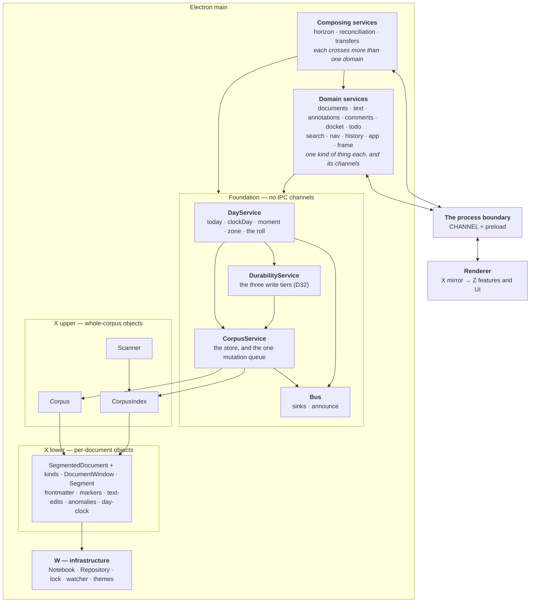

# Service layers — splitting `DocumentService`

**Status: designed 2026-09-13; the core's store, queue, bus and write tiers are
built.**
`architecture-as-built.md` describes what *is*; this describes what we are going
to do, and each piece moves into that file as it lands. Decided in D83. Progress
is tracked under *Order of work* at the foot — **1a is done**, and nothing above
the core has moved yet.

## Why

`DocumentService` is 2,805 lines and 150 members across twelve internal
sections. Size is the symptom. **The cause is that it holds three layers at
once**, so every flow in it has a free hand on everything else, and nothing in
the type system or the file structure says which reaches are legitimate.

The evidence that this is structural rather than cosmetic: **docket and todo
already call each other.**

- `todoPutDown` → `docketAdd`, `matterFor` — todo reaches into docket
- `#reconcileDocketsOnce` → `todoList`, `todoItems`, `todoAdd`, `todoRemove` —
  docket reaches into todo

A flat set of peer services would be mutually dependent on the first day. So the
split is not *which verbs go where* — it is **which layer each thing is on**, and
the cycle is what proves the layers exist.

## The seam

The split follows the **IPC channel boundary**, because that boundary is already
real: everything crossing it is plain data, so every service contract is narrow
and testable by construction. The shape is proven twice in-tree — `docket` and
`todo` are single channels carrying a command union, and both were pleasant to
extend, where the other 69 channels are one-per-verb and cost four file edits
apiece to add to.

**Each channel is registered by exactly one service.** A service may own several
channels; a few own none, being pure readers.

## The layers



**Corpus and CorpusIndex are peers**, both built over the notebook and both
reaching the same per-document objects — which is why they belong to one layer
and why `CorpusService` is the single interface onto the pair. `Scanner` is
X-upper too but is **not** its: only search uses it, so the search service owns
it.

## The rule

> **The dependencies form a DAG.**

That is the whole constraint. The tiers in the diagram are a coarse reading aid,
not the rule — **the number of layers does not matter and neither does the number
of services**; what matters is that each service's scope is nameable in a phrase
and that nothing points back up. **Every file names its tier and what it may
depend on in its opening comment**, so the reach a file is allowed is legible
before reading a line of it.

**Numbered levels were the first draft and they broke twice.** Durability and the
day both need the corpus, which as numbered peers would have been a forbidden
sideways call; and *which rung* a foundation service shares with a domain service
is not a meaningful question. Acyclic answers both.

**Foundation services own no channels.** A channel is something the renderer has
a name for, and there is nothing on the far side of the fence that corresponds to
a corpus or a queue — the UI has no reason to talk to anything that low. So the
whole foundation is invisible from the renderer, and exists to be depended on.

**Lower things emit; higher things subscribe.** `corpus.onChanged → touched()`
reads like the corpus reaching up into durability, and it is the reverse:
durability asks the corpus to tell it. The dependency points down while the news
travels up. This is the second place the pattern has been the answer — the
reconciler is the other — which makes it the general rule here rather than one
trick.

This is what breaks the docket/todo cycle honestly: docket stops knowing about
todo, todo stops knowing about docket, and the three flows that genuinely span
both move up to where spanning is the job.

**That layer-2 list is not arbitrary** — the horizon, the reconciler and the
transfer gestures are the three features that produced the most design
discussion in the last fortnight, and they are the three that were structurally
homeless. D78 already says the horizon is its own object *implemented by* its
sources; this gives that sentence somewhere to live.

## The foundation's four contracts

One each, and each nameable in a phrase — which is the test the single
`CoreService` was failing:

1. **`Bus`** — where a pushed message goes. Depends on nothing, which is what
   lets the other three use it without depending on each other.
2. **`CorpusService`** — *the corpus, and the discipline for writing to it*: the
   store, and **one** mutation queue. The queue is why this class must exist at
   all, because **idempotence has to hold concurrently, not merely repeatedly**
   (note 51 — two overlapping passes generated the same task). A second queue
   anywhere would break that silently, and a data race is the failure the tests
   are worst at catching.
3. **`DurabilityService`** — the three write tiers (D32), each *quiescence OR a
   ceiling*, never quiescence alone.
4. **`DayService`** — what day the app is filing into, and the notebook's zone
   (D62, D63). **Not the zone *offer***, which is session UI state and belongs to
   the app service: D63's rule is that the zone is offered and never applied, so
   the offer is not a fact about the notebook at all. The `zone` itself is here
   because it is an input to date *arithmetic* — `dueOn` is zone-aware, and
   getting that wrong is what made a task finished at 17:42 in a GMT+8 notebook
   come due "tomorrow".

**Where `reconcile()` goes, and the inversion it forces.** Reconciliation is a
*composing* service — it reads dockets and writes the task list — so it sits at
the top of the DAG, while `wrote()` is the ordinary end of every verb down in the
foundation. The foundation therefore cannot call it. Services **register** passes
instead:

```ts
reconciles(name: string, pass: () => Promise<unknown>): void
reconcile(): Promise<Record<string, unknown>>
```

run serialised and never re-entrantly, by something that knows nothing about what
the passes do. D77 says `reconcile()` is *make all derived state true again*,
with dockets as its **first clause** — registration turns that phrase from a
comment into the structure, and a second clause costs a registration rather than
an edit to the reconciler.

**Still open: who holds the registry.** It cannot be `CorpusService`, whose scope
is the store and the queue. A fifth foundation service for it would be a class
holding one array. The likeliest answer is that the pass queue belongs to the
reconciliation service itself, and the verbs that want a pass after writing ask
*it* — which makes the edge point up from domain to composing, and that is legal
in a DAG as long as nothing comes back down. To be settled when 1d is built.

## The naming fault to fix on the way

`tephra:win:` currently means two different things: `CHANNEL.edit` is a **text
window** and `CHANNEL.windowInfo` is an **OS window** (MC6). Two senses of one
word under one prefix will make the service names ambiguous the moment they are
written down. The vocabulary splits: **text** for the buffer, **frame** for the
OS window.

## The channel grouping

| service | tier | channels | owns |
|---|---|---|---|
| **Bus** | foundation | — | sinks |
| **CorpusService** | foundation | — | Corpus, CorpusIndex, the stream, **the mutation queue** |
| **DurabilityService** | foundation | — | the three write tiers (D32) |
| **DayService** | foundation | — | the clock, the notebook's zone |
| **documents** | 1 | open, read, new, rename, duplicate, delete, importText, branch, linkBase, openLink, print, attachImage, chooseImage | lifecycle and identity |
| **text** | 1 | edit, release, extend, flush, undo, redo, spans, proseIn, extent | windows, desync |
| **annotations** | 1 | tag, untag, renameTag, setAnchor, removeAnchor, resolveAnchor | — |
| **comments** | 1 | 8 → one union | — |
| **docket** | 1 | docket | — |
| **todo** | 1 | todo | — |
| **search** | 1 | searchOpen/Next/Close | Scanner, the cursors |
| **nav** | 1 | 13 `nav:*` | — (reads core's index) |
| **history** | 1 | versions, readDay, restore | StreamHistory |
| **app** | 1 | today, anomalies, zone×3, clipboard, emoji, quit, uiState×2, themes×3 | the zone offer, UI state |
| **frame** | 1 | windowInfo/Create/Reveal/Close/Import/Report | the window set |
| **horizon** | 2 | horizon | — (calls docket and todo) |
| **reconciliation** | 2 | — | registered with core |
| **transfers** | 2 | — | put-down, move-to |

Twelve of these own state; four are thin routers over objects that already exist
as modules (`searches.ts`, `windows.ts`, `CorpusIndex`, `Repository`), which is a
useful result on its own: a good part of the 2,805 lines is delegation that can
leave the file without a single design decision.

## Order of work

1. **Core first**, extracted whole, with `DocumentService` left calling it. No
   service moves yet, so the acceptance suites are the proof the extraction was
   faithful.
   - **1a done, 2026-09-13** — `main/core-service.ts` holds the store (`Corpus`,
     `CorpusIndex`, the stream, the notebook), the **mutation queue**, and the
     bus (`addSink`, `announce`, `changed`). `DocumentService` constructs it and
     reaches it through forwarders under the old private names — `#corpus`,
     `#stream`, `#index`, `#serial` — so **no call site moved**. There are
     sixty-eight `#serial` calls alone; rewriting them in the change that moves
     the queue would have meant proving two things at once, with the suites
     unable to say which had gone wrong. The forwarders go as each service is
     split out and starts naming `#core` directly.
   - **1b done, 2026-09-13** — the three write tiers (D32): the WAL, the file
     tier, the version tier, plus `flush`, `stop`, `recover`, `saveVersion`,
     `openHistory` and the `history`/`repository` accessors. **The four corpus
     and notebook subscriptions moved with them** — the journal, the change
     watch, the external-change reload, the divergence notice — because they are
     what *feed* the tiers, and leaving them behind would have meant the core
     owning the tiers while something above it decided when they fired.
     `DocumentService` went 2,805 → 2,495 lines; the core is 553.
     - Three `#scheduleFlush()` callers — `edit`, `undo`, `redo` — wanted the
       file timer **without** marking unversioned work, so that became
       `core.writeSoon()` rather than being folded into `touched()`. An undo
       that puts a document back exactly as it was found should not tell the
       version tier there is something to commit.
     - The history *reads* — `versions`, `readDay`, `restore` — stayed put.
       They are the history service's, layer 1, not durability.
   - **1c** — the day: `today`, `zone`, the roll.
   - **1d** — the reconciler inversion: `reconciles(name, pass)`.
2. **`registerIpc`**, so a service can claim its own channels and the 74-case
   switch in `ipc.ts` can shrink a service at a time.
3. **Comments as the pilot** — 129 lines, 13 members, a clean domain, collapses
   eight channels into one union, **and it writes documents**, so it exercises
   the risky part (core access, the write path) while staying small enough to
   throw away if the pattern comes out wrong. Deliberately not `nav`, which is
   bigger and would delete more of the switch but is read-only and would prove
   only the registration mechanism.
4. The rest, thin routers first.
5. **Layer 2 last**, because it is the part the cycle lives in, and by then both
   its dependencies are behind interfaces.

Each step ends green on `npm test` and the acceptance suites; none of them
changes behaviour.
